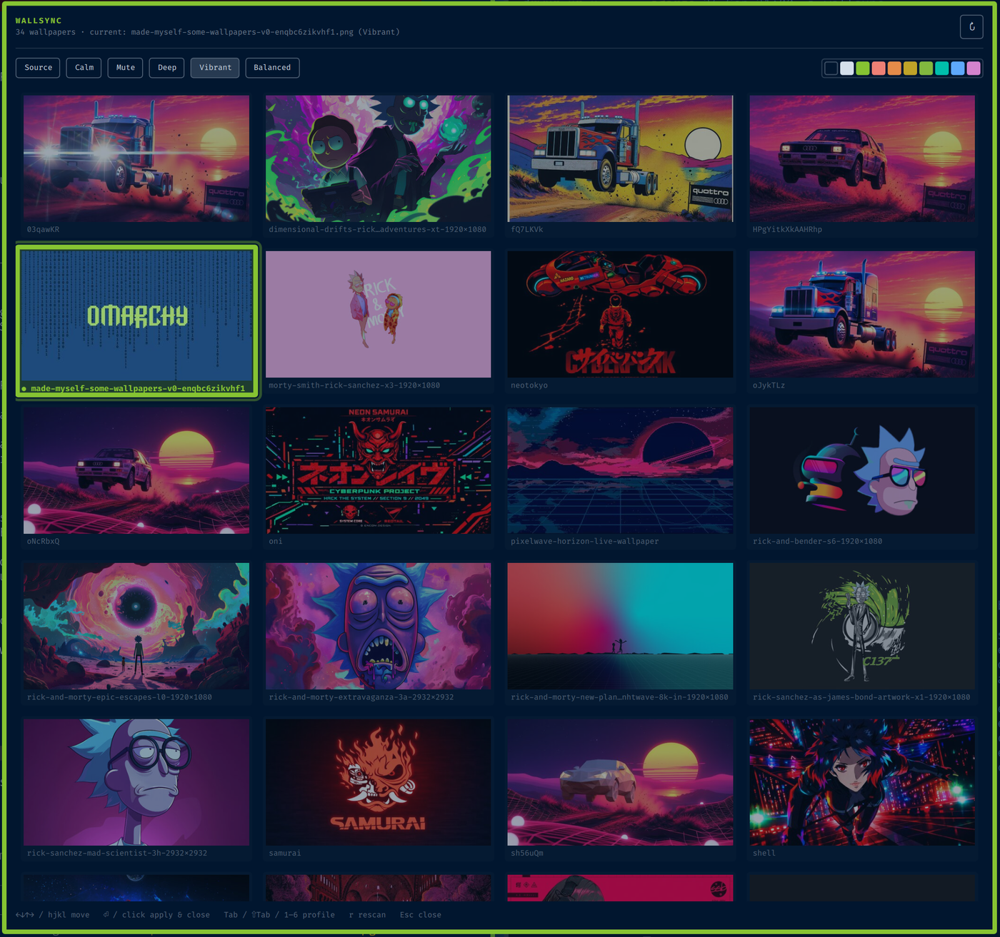

# Wallsync

Pick a wallpaper from a grid; it becomes your background and the whole Omarchy
palette (terminals, bar, Hyprland borders, btop, editors, …) is generated from
it, using the selected color profile.



## Install

```sh
omarchy plugin add https://github.com/jgarza9788/wallsync.git --enable
~/.config/omarchy/plugins/jgarza.wallsync/extras/install.sh   # once: menu + launcher entry
```

Requires `magick` (ImageMagick) and `python3`, both standard on Omarchy.

## Open it

- `SUPER+SPACE` → **Wallsync**
- `omarchy-shell shell toggle jgarza.wallsync '{}'` (bind this to a key if you like)

## Keys

| | |
|---|---|
| `←↓↑→` / `hjkl` | move |
| `⏎` / click | apply and close |
| `Tab` / `⇧Tab` / `1`–`6` | color profile |
| `f` / click ☆ | toggle favorite (favorites stay at the top) |
| `r` | rescan the folder |
| `Esc` / `q` | close |

The swatch strip shows the palette the highlighted image will produce under
the current profile.

## Color profiles

The same six directions as Omagen, but generated by Wallsync from the image
itself: the **most-used** color sets the background (and dark/light mode), the
**most saturated** color becomes the accent, and each terminal color takes the
image's own nearest hue when it has one.

| Profile | |
|---|---|
| Source   | closest to the image's own colors |
| Calm     | quieter, less aggressive |
| Mute     | restrained, reduced intensity |
| Deep     | darker, more atmospheric |
| Vibrant  | stronger, more expressive |
| Balanced | between image character and usability |

Every profile is then contrast-checked (text 4.5:1, bright text 7:1, terminal
colors 3:1) by adjusting lightness only. Tune the profiles in the `PROFILES`
table in `bin/wallsync-palette`.

## How it works

- `bin/wallsync-list` lists `~/Pictures/Wallpapers` (override with `$WALLSYNC_DIR`)
  and caches thumbnails in `~/.cache/jgarza.wallsync/thumbs`.
- `bin/wallsync-palette <image> [profile] [--json]` samples the image with
  ImageMagick and prints a `colors.toml`.
- `bin/wallsync-apply <image> [profile]` writes the theme
  `~/.config/omarchy/themes/wallsync/` (colors.toml + the one background) and runs
  `omarchy theme set wallsync`, which regenerates every app config from the
  palette. The last choice is saved in `~/.config/omarchy/jgarza.wallsync/state.json`.
- Favorites are a JSON list of image paths in
  `~/.config/omarchy/jgarza.wallsync/favorites.json`.

To go back to a regular theme: `omarchy theme set <name>`.
